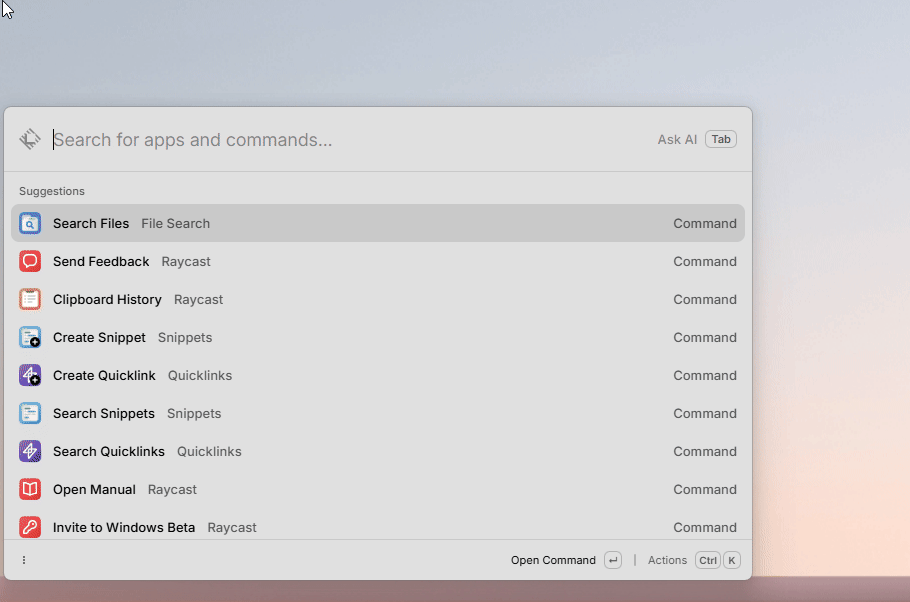

# PowerShell Functions for Raycast

Lists parameterless functions from a selected `.ps1` file and executes them on demand. Discovery is performed by a
linear TypeScript parser and never starts PowerShell; `pwsh.exe` is launched only after selecting a function.



## Function metadata

Add optional metadata immediately above a function:

```powershell
# @raycast.title Restart Development
# @raycast.icon Icon.RotateClockwise
# @raycast.description Restarts local services
# @raycast.keywords docker, development
# @raycast.confirm true
# @raycast.timeout 120
function Restart-Development { }
```

`timeout` is expressed in seconds. Functions with declared parameters are intentionally not listed.

## Development

- Install Node.js with `winget install -e --id OpenJS.NodeJS`.
- Run `npm ci`.
- Run `npm run dev` to add the extension to Raycast.
- Run `npm test` and `npm run benchmark` to validate parser correctness and performance.
